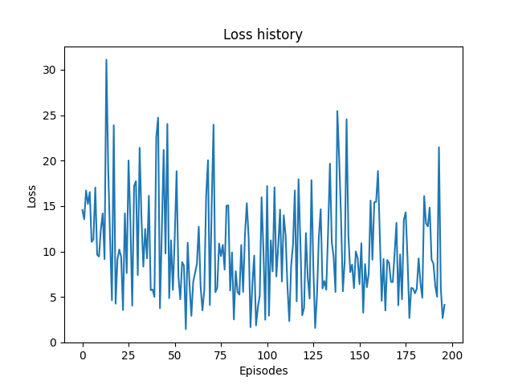

# RL-Ridesharing
### Effcient Ridesharing Dispatch Using Reinforcement Learning [[Report](https://github.com/UMich-ML-Group/RL-Ridesharing/blob/master/RL_Ridesharing_Final_Report(1).pdf)]

Code for EECS 545: Machine Learning Project

**Team Members:**  
[Brian Fogelson*](https://github.com/bfogels), [Hansal Shah*](https://github.com/hansalshah), [Oscar De Lima*](https://github.com/oidelima), [Tim Chu*](https://github.com/tim-ts-chu) \
\* _Indicates equal contribution_

## Requirements
- Python 3.7.x
- PyTorch 1.4.0

## Training and evaluation

**Variable number of cars and passengers between episodes**

   1. Open agent_variable.py
   2. Set the variables max_cars and max_passengers to your desired maximum number of cars and passengers per episode.
   3. Set the init_cars and init_passengers variables to the number of cars and passengers you want to have in the first episode.
   4. Modify the GridMap object assigned to the grid_map variable by selecting the size of the grid (# of rows, # of columns) and the random seed.
   5. Modify the hidden size variable corresponding to the hidden size of the agent network.
   6. To use a specific model checkpoint, set the load_file variable to the name of the .pth file. Otherwise, set load_file to None.
   7. Set the arguments of the Agent object assigned to the agent variable to choose the learning rate (lr), the size of the hidden layer of the mixing network (mix_hidden), the batch size (batch_size), the epsilon decay (eps_decay), the number of episodes (num_episodes), the mode (mode =  "random" or "greedy" or "dqn" or "qmix"), and whether we are training or not (Training = True or False).
   8. Run agent_variable.py
   8. `python agent_variable.py`
   
**To have a fixed number of cars and passengers between episodes**
   1. Open agent.py
   2. Set the variables num_cars and num_passengers to your desired number of cars and passengers for each episode.
   3. Follow instructions 4, 5, 6 and 7 for the scenario with variable cars and passengers shown above.
   4. `python agent.py`
   

# Feature Representation

In order to reduce the action space, so the action now is a pair decision for one car, meaning we need an indicator to point out which car we are pairing now.

### Observation: = [indicator, cars, passengers]

indicator: one-hot encoding to indicate which car we are pairing now

cars: [car_1, car_2, ..., car_max] where car_n = (position_x, position_y)

passengers: [person_1, person_2, ..., person_max] where person_n = (pick_up_x, pick_up_y, destination_x, destination_y)

* Example:

car_max = 3, passenger_max = 4

observation will be a vector with dimension: 3+3\*2+4\*4 = 25

### Action: = [passengers_q, ignore]

passengers_q: [person_q_1, person_q_2, ..., person_q_max]

ignore: is a scalar, meaning the q-value of choosing do nothing.

* Example:

car_max = 3, passenger_max = 4

action will be a vector with dimension: 4+1 = 5

### Reward: = (constant_drop_off_reward - \#steps_waiting_for_pick_up), which is a scalar

reward is given to the environment when the passenger has been drop off.

We can use a callback (traceback) function to relate the reward to a certain previous action caused the reward, and then put into replay buffer.

* Example

Let constant_drop_off_reward = 100
A passenger is picked up 23 environment steps after.
The reward from this passenger is 100-23=77 and is given after drop off .

### Environment step: represent world timestamp

For one environment step, either car move foward a grid, require_step minus 1, pick up, or drop off.

### Algorithem step: Whenever the pair is required

The length of alforithem step is varied in terms of environment steps, and is lasting until the next alforithem happen or termination.

condition1: there is at least 1 passenger request which hasn't be served.

condition2: there is at least 1 avaliable car

### Environment initialization:
Randomly assign costs of road.

### Episode Start:
Uniformly generate cars and passangers on the map.

### Episode Termination:
All the passangers have been served.

For now, there is no passenger will be generated during the episode. (We can test more complicated senario later 

## Purpose Algorithm QMIX
QMIX provides centralized training with decentralized execution. QMIX employs a network that estimates joint action-values as a complex non-linear combination of per-agent values that condition only on local observations. 
 
## Huber loss function is used 

After Training loss plot 
